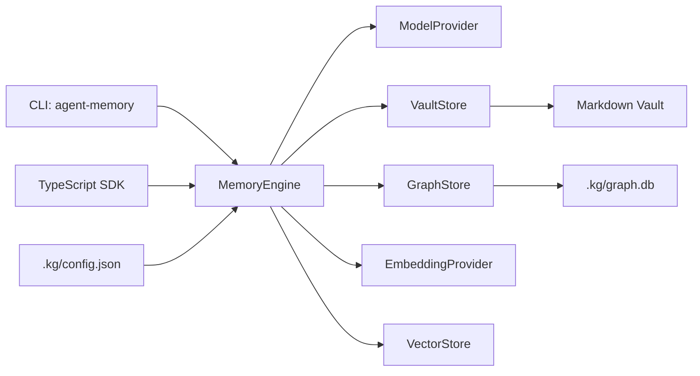
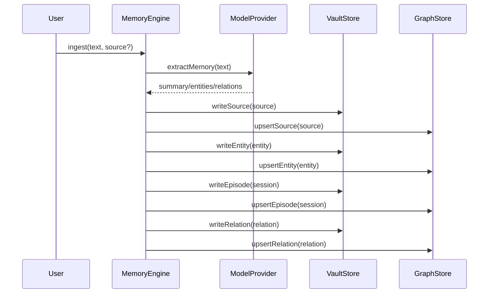
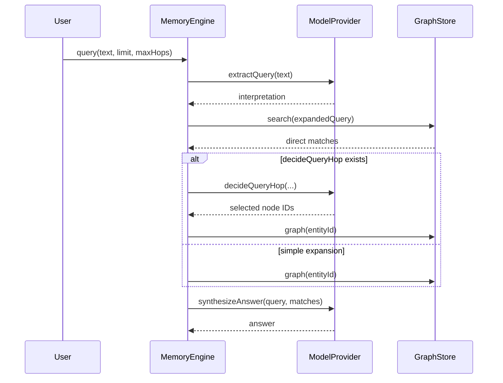

# Architecture

## Overview

Agent Memory Knowledge Graph is a local-first memory graph for agents. It combines a TypeScript SDK, a CLI, an Obsidian-compatible Markdown vault, SQLite FTS5 indexes, and replaceable LLM providers.

Core design choices:

- The Markdown vault is the human-readable and human-editable projection.
- SQLite is the canonical index, relationship, and full-text search layer.
- The LLM provider extracts structured memory, interprets queries, chooses graph hops, and synthesizes answers.
- `MemoryEngine` is the orchestration layer used by both the SDK and CLI.



## Subsystems

### MemoryEngine

`MemoryEngine` owns the main workflows:

- Initialize the vault, config, and SQLite database.
- Ingest text into sources, entities, sessions, and relations.
- Query memory through FTS search, optional graph expansion, and answer synthesis.
- Create manual links between entities.
- Rebuild SQLite from Markdown.
- Reindex FTS.
- Import and export graph snapshots.
- Report status and run diagnostics.

The CLI should not bypass `MemoryEngine` to manipulate vault or database state. Add new behavior to the engine first, then expose it through CLI commands.

### VaultStore

`VaultStore` defines the Markdown projection interface. The default implementation writes an Obsidian-style local vault:

```text
People/
Projects/
Bugs/
Rules/
Concepts/
Sessions/
Graph/
Dashboards/
Templates/
.kg/
```

Entity type routing:

- `person` -> `People/`
- `project` -> `Projects/`
- `bug` -> `Bugs/`
- `rule` -> `Rules/`
- `concept/topic/artifact/decision/unknown` -> `Concepts/`

Sessions are written to `Sessions/`, with source metadata embedded in session frontmatter. Relations are written to `Graph/`.

### GraphStore

`GraphStore` is the normalized data and search abstraction. The default implementation uses `node:sqlite` and FTS5.

Main tables:

- `entities`
- `relations`
- `episodes`
- `sources`
- `aliases`
- `tags`
- `entity_episode_refs`
- `relation_evidence_refs`
- `memory_fts`

The internal data model still uses `episodes` and `sources`; the user-facing vault projects episodes as `Sessions/` and stores source metadata inside session frontmatter.

### ModelProvider

`ModelProvider` abstracts all model calls:

- `extractMemory`: extract summary, entities, and relations from text.
- `extractQuery`: turn a natural-language query into keywords, entities, predicates, and an FTS-friendly query.
- `decideQueryHop`: optionally choose graph expansion nodes.
- `synthesizeAnswer`: produce a natural-language answer from matches.
- `compact`: optionally compact accumulated observations.
- `doctor`: optionally report provider health.

The default provider is `CopilotSdkModelProvider`. `CopilotCliModelProvider` remains available for compatibility.

### EmbeddingProvider and VectorStore

These are reserved extension points. The current defaults are noop implementations, and the main ingest/query flow does not yet use vector search.

A future hybrid search implementation can embed content during ingest, query vector matches at search time, and merge them with FTS matches.

## Data Flow

### Ingest



The default vault does not write standalone source files. `writeSource` caches source metadata, and `writeEpisode` embeds it into the session frontmatter.

### Query



`maxHops` defaults to 2 and is capped at 3. Each hop can select up to 5 nodes.

### Rebuild

`rebuild` reads entities, relations, sessions, and embedded source metadata from the Markdown vault, then rebuilds SQLite tables and FTS indexes.

After manually editing Markdown, run:

```bash
agent-memory rebuild --vault ./memory-vault
```

## Extension Points

- New model provider: implement `ModelProvider` and dispatch by `config.model.provider`.
- New graph backend: implement `GraphStore` and replace the SQLite store.
- New vault projection: implement `VaultStore` and replace the Obsidian Markdown store.
- Vector search: implement `EmbeddingProvider` and `VectorStore`, then integrate them into `MemoryEngine.ingest/query`.
- New CLI command: add the behavior to `MemoryEngine`, then wrap it in the CLI.
- New entity type: update `EntityType`, prompts, vault routing, and tests.

## Development Notes

- The project is ESM with TypeScript `NodeNext`; source imports intentionally use `.js` extensions.
- Node.js `>=22.13` is required because the default store uses `node:sqlite`.
- `dist/` is build output and should not be edited by hand.
- Configuration is JSON at `.kg/config.json`; YAML is not used.
- The user-level default vault path is stored in `~/.agent-memory/config.json`; command resolution order is `--vault`, user default, then `~/agent-memory/MyVault`.
- The current implementation does not support old vault layout compatibility or migration.
- LLM failures do not fall back to heuristic extraction or answering.
- There is no full migration framework for SQLite schema changes yet, so schema updates need careful compatibility work.

## Testing

Current tests cover:

- Engine initialization, ingest, query, link, rebuild, and export.
- New vault folders and `.kg` files.
- Typed entity folder routing.
- Embedded source metadata in sessions.
- CLI init, doctor, and config set/get.
- Frontmatter roundtrip.
- Copilot CLI provider prompt passing.

Common commands:

```bash
npm run typecheck
npm test
```
