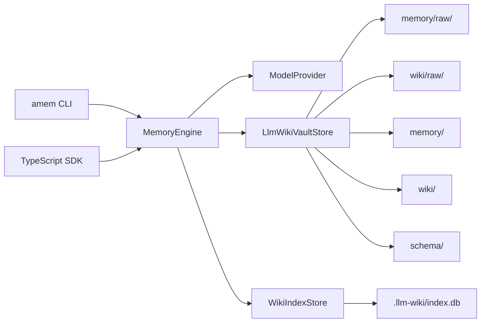

# Architecture: Agent Memory

Agent Memory is now a local-first, memory-first runtime memory system. `memory/raw` and `wiki/raw` are separate raw input lanes, and `consolidate` turns them into memory entities and wiki entities automatically.

## Principles

- The filesystem is the source of truth.
- `memory/raw/` stores raw inputs that should become runtime memory entities.
- `wiki/raw/` stores raw inputs that should become human-facing wiki entities.
- `raw/` remains as a legacy-compatible import location.
- `memory/` stores staged runtime memory.
- `wiki/` stores human-readable Markdown entity pages.
- `schema/` stores page types, style guidance, and lint rules.
- `.llm-wiki/index.db` is only a rebuildable SQLite FTS search index.

## Data Flow

## Ingest

1. `MemoryEngine.ingest` writes to `memory/raw/YYYY/MM/DD/...md` by default.
2. With `--target wiki`, ingest writes to `wiki/raw/YYYY/MM/DD/...md`.
3. Hand-authored raw files do not need to be Markdown; plain-text `.txt` files are ingested too.
4. `MemoryEngine.consolidate` turns `memory/raw` into `session_summary`, `candidate`, and `long_term` entities.
5. `MemoryEngine.consolidate` turns `wiki/raw` directly into final `wiki/` entity pages.
6. Before writing, the engine browses existing entities and attaches the raw source to an existing related entity whenever possible.
5. `WikiIndexStore` rebuilds the search index from files.

## Query

1. SQLite FTS searches queryable `memory/` pages first, then `wiki/` pages.
2. `session_summary` and `wiki_update_candidate` pages are excluded from default query.
3. The engine loads raw sources referenced by matching pages.
4. The model answers using only matched pages and sources.
5. JSON output is `{ answer, pages, sources }`.

## Legacy Review Flow

1. `wiki_update_candidate` is kept only for legacy review artifacts created by older vaults.
2. `approve-wiki-update` and `reject-wiki-update` handle those legacy artifacts.
3. The current `consolidate` workflow no longer requires user approval by default.

## Lint

`amem lint` checks wiki health:

- missing raw sources,
- missing `## Sources`,
- broken `[[wikilink]]` references,
- duplicate titles,
- unreferenced raw documents,
- optional model-reported contradictions or duplicate topics.

`--fix` only performs deterministic formatting fixes.

## SDK and Authentication

- The root package entry can be imported directly by other Node.js or TypeScript projects.
- `copilot-sdk` accepts a token from `config.model.githubToken`, `AGENT_MEMORY_GITHUB_TOKEN`, or `GITHUB_TOKEN`.
- If a token is present and `useLoggedInUser` is not explicitly set, Agent Memory defaults to token-based auth.
