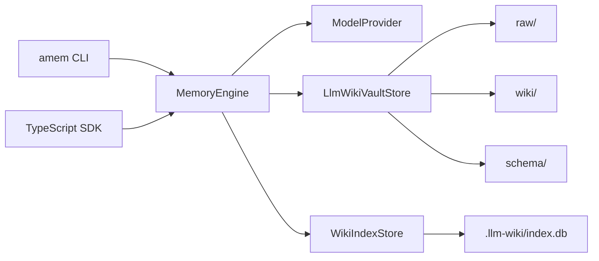

# Architecture: LLM Wiki

Agent Memory is now a local-first LLM Wiki compiler, not an entity/relation graph system.

## Principles

- The filesystem is the source of truth.
- `raw/` stores immutable source documents from every ingest.
- `wiki/` stores model-maintained, human-readable Markdown pages.
- `schema/` stores page types, style guidance, and lint rules.
- `.llm-wiki/index.db` is only a rebuildable SQLite FTS search index.

## Data Flow

## Ingest

1. `MemoryEngine.ingest` writes the input into `raw/YYYY/MM/DD/...md`.
2. The model reads the raw document, relevant wiki pages, and schema, then returns a `WikiUpdatePlan`.
3. The vault creates or rewrites `wiki/<slug>.md` pages.
4. Every page must include `## Sources` and cite raw ids.
5. `WikiIndexStore` rebuilds the search index from files.

## Query

1. SQLite FTS searches wiki pages.
2. The engine loads raw sources referenced by matching pages.
3. The model answers using only matched pages and sources.
4. JSON output is `{ answer, pages, sources }`.

## Lint

`amem lint` checks wiki health:

- missing raw sources,
- missing `## Sources`,
- broken `[[wikilink]]` references,
- duplicate titles,
- unreferenced raw documents,
- optional model-reported contradictions or duplicate topics.

`--fix` only performs deterministic formatting fixes.
