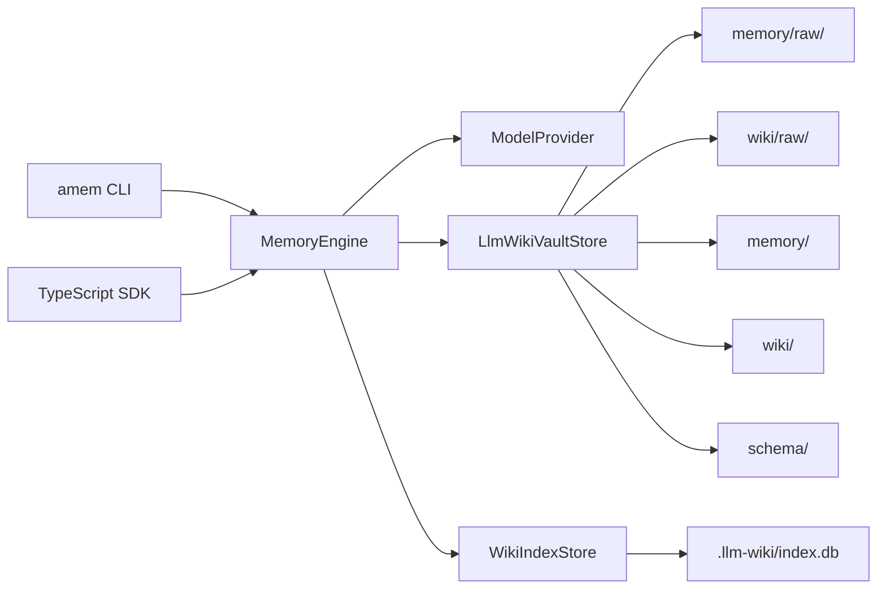

# 架构：Agent Memory

Agent Memory 现在是一个本地优先、memory-first 的运行时记忆系统；`memory/raw` 和 `wiki/raw` 是两个原始输入入口，`consolidate` 会把它们分别整理成 memory 实体和 wiki 实体。

## 核心原则

- 文件系统是 source of truth。
- `memory/raw/` 保存会被整理成运行时记忆实体的原始输入。
- `wiki/raw/` 保存会被整理成正式 wiki 实体的原始输入。
- `raw/` 作为旧版兼容导入目录保留。
- `memory/` 保存分阶段的运行时记忆。
- `wiki/` 保存人类可读的 Markdown 实体页面。
- `schema/` 保存页面类型、写作风格和 lint 规则。
- `.llm-wiki/index.db` 只是可重建的 SQLite FTS 搜索索引。

## 数据流

## Ingest

1. `MemoryEngine.ingest` 默认把输入写入 `memory/raw/YYYY/MM/DD/...md`。
2. 传 `--target wiki` 时，输入会写入 `wiki/raw/YYYY/MM/DD/...md`。
3. 手写 raw 文件不必是 Markdown；纯文本 `.txt` 也会被读取。
4. `MemoryEngine.consolidate` 会把 `memory/raw` 生成 `session_summary`、`candidate` 和 `long_term` 实体。
5. `MemoryEngine.consolidate` 会把 `wiki/raw` 直接更新或创建 `wiki/` 下的正式实体页面。
6. 在整理前会浏览已有 entity；如果关联明显，raw 会并入已有 entity 并追加 source。
5. `WikiIndexStore` 从文件重建搜索索引。

## Query

1. 通过 SQLite FTS 先搜索可查询 `memory/` 页面，再搜索 `wiki/` 页面。
2. 默认排除 `session_summary` 和 `wiki_update_candidate`。
3. 读取页面引用的 raw source。
4. 模型只基于命中的页面和 source 合成答案。
5. JSON 输出为 `{ answer, pages, sources }`。

## Legacy Review Flow

1. `wiki_update_candidate` 只为旧版 vault 的待审核草案保留。
2. `approve-wiki-update` 和 `reject-wiki-update` 仅用于处理这些旧草案。
3. 新的 `consolidate` 流程默认不再要求用户审批。

## Lint

`amem lint` 负责维护 wiki 健康度：

- 缺少 raw source。
- 缺少 `## Sources`。
- 断裂的 `[[wikilink]]`。
- 重复标题。
- 未被引用的 raw 文档。
- 模型可选检查潜在矛盾和重复主题。

`--fix` 只做确定性格式修复，不自动合并矛盾内容。

## SDK 与鉴权

- 包的根入口可以直接被其它 Node.js / TypeScript 项目导入。
- `copilot-sdk` 支持通过 `config.model.githubToken`、`AGENT_MEMORY_GITHUB_TOKEN` 或 `GITHUB_TOKEN` 提供 token。
- 当 token 存在且未显式指定 `useLoggedInUser` 时，默认优先使用 token 鉴权。

## 开发注意事项

- 项目是 ESM + TypeScript `NodeNext`。
- Node.js 需要 `>=24.15.0`，因为索引层使用 `node:sqlite`。
- `dist/` 是构建产物，不要手工编辑。
- 常用验证命令：`npm run typecheck`、`npm test`。
