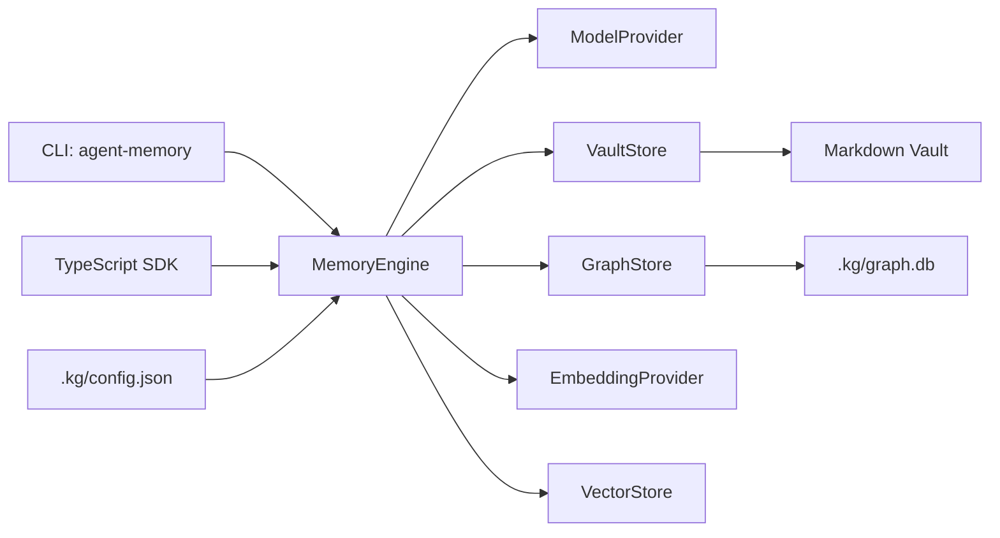
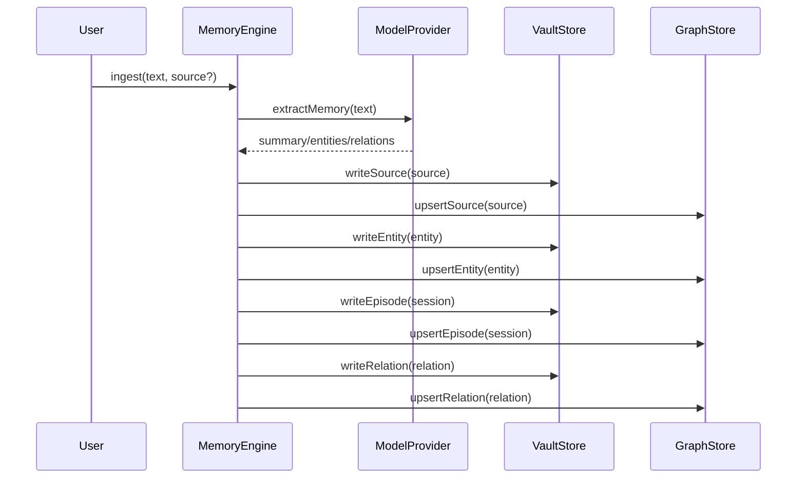
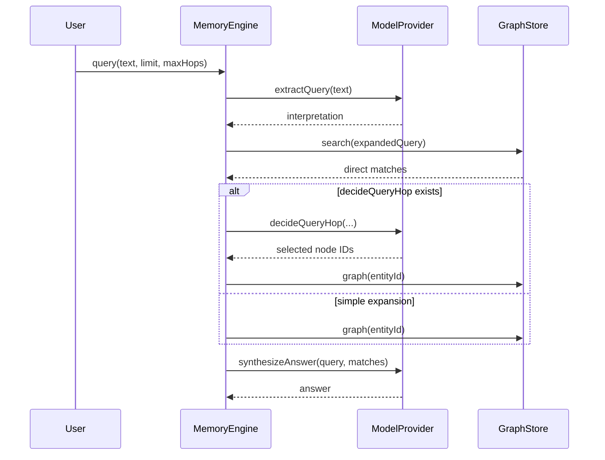

# 中文架构文档

## 总览

Agent Memory Knowledge Graph 是一个本地优先的记忆图谱系统，由 TypeScript SDK、CLI、Markdown vault、SQLite FTS5 索引和可替换 LLM provider 组成。

核心设计：

- Markdown vault 是人类可读、可编辑的知识投影。
- SQLite 是规范化索引、关系查询和全文搜索层。
- LLM provider 负责把自然语言转成结构化记忆、解释查询、选择图谱跳转、合成答案。
- `MemoryEngine` 是唯一的编排层，CLI 和 SDK 都通过它访问系统能力。



## 子系统

### MemoryEngine

`MemoryEngine` 是业务流程入口，负责：

- 初始化 vault、配置和 SQLite。
- ingest 文本并写入 source、entity、session、relation。
- query 记忆，执行 FTS 搜索、可选图谱扩展和答案合成。
- link 手动创建关系。
- rebuild 从 Markdown 重建 SQLite。
- reindex 重建 FTS 索引。
- import/export 结构化快照。
- status/doctor 诊断系统状态。

CLI 不直接操作 vault 或 SQLite；新增业务能力应优先进入 `MemoryEngine`，再由 CLI 包装。

### VaultStore

`VaultStore` 定义 Markdown vault 的投影接口。默认实现是 Obsidian 风格的本地文件结构：

```text
People/
Projects/
Bugs/
Rules/
Concepts/
Sessions/
Graph/
Dashboards/
Templates/
.kg/
```

实体按类型路由：

- `person` -> `People/`
- `project` -> `Projects/`
- `bug` -> `Bugs/`
- `rule` -> `Rules/`
- `concept/topic/artifact/decision/unknown` -> `Concepts/`

Session 写入 `Sessions/`，source metadata 写入 session frontmatter。Relation 写入 `Graph/`。

### GraphStore

`GraphStore` 是规范化数据和搜索接口。默认实现基于 `node:sqlite` 和 FTS5：

- `entities`
- `relations`
- `episodes`
- `sources`
- `aliases`
- `tags`
- `entity_episode_refs`
- `relation_evidence_refs`
- `memory_fts`

SQLite 中仍保留 `episodes` 和 `sources` 这样的内部领域名称；用户可见 vault 中对应的是 `Sessions/` 和嵌入式 source metadata。

### ModelProvider

`ModelProvider` 抽象所有模型能力：

- `extractMemory`: 从文本抽取 summary、entities、relations。
- `extractQuery`: 把用户查询解释为关键词、实体、谓词和 FTS 查询。
- `decideQueryHop`: 可选，用模型决定是否继续图谱扩展。
- `synthesizeAnswer`: 用搜索结果合成自然语言回答。
- `compact`: 可选，用于压缩历史观察。
- `doctor`: 可选，用于检查 provider 状态。

默认 provider 是 `CopilotSdkModelProvider`，兼容 provider 是 `CopilotCliModelProvider`。

### EmbeddingProvider 和 VectorStore

这两个接口是预留扩展点。当前默认实现是 noop，主流程尚未把 embedding/vector search 接入 ingest/query。

未来可以在 ingest 后写入向量，在 query 时把 FTS matches 和 vector matches 混合排序。

## 数据流

### Ingest



注意：默认 vault 不再写独立 source 文件，`writeSource` 会缓存 source，后续 `writeEpisode` 将其嵌入 session frontmatter。

### Query



`maxHops` 默认是 2，最大限制是 3。每一跳最多选择 5 个节点。

### Rebuild

`rebuild` 从 Markdown vault 读取实体、关系、sessions 和嵌入的 source metadata，然后重建 SQLite 表和 FTS 索引。

这意味着人工编辑 Markdown 后，应执行：

```bash
agent-memory rebuild --vault ./memory-vault
```

## 扩展点

- 新模型：实现 `ModelProvider`，在 provider 分发逻辑中按 `config.model.provider` 创建。
- 新图存储：实现 `GraphStore`，替换 SQLite。
- 新 vault 格式：实现 `VaultStore`，替换 Obsidian Markdown 文件投影。
- 向量搜索：实现 `EmbeddingProvider` 和 `VectorStore`，并在 `MemoryEngine.ingest/query` 接入。
- 新 CLI 命令：先在 `MemoryEngine` 增加行为，再在 CLI 中调用。
- 新实体类型：扩展 `EntityType`、模型提示词、vault 类型路由和测试。

## 开发注意事项

- 项目是 ESM + TypeScript `NodeNext`，源码 import 使用 `.js` 后缀。
- Node.js 需要 `>=22.13`，因为默认 store 使用 `node:sqlite`。
- `dist/` 是构建产物，不要手工编辑。
- 配置文件是 JSON，不是 YAML，路径是 `.kg/config.json`。
- 用户级默认 vault 路径保存在 `~/.agent-memory/config.json`；命令解析优先级是 `--vault`、用户默认路径、`~/agent-memory/MyVault`。
- 当前不支持旧 vault 布局兼容或迁移。
- LLM 失败时不会做启发式 fallback。
- Schema 目前没有完整 migration 系统，改 SQLite schema 要同步考虑旧数据库行为。

## 测试策略

现有测试覆盖：

- Engine 初始化、ingest、query、link、rebuild、export。
- 新 vault 目录和 `.kg` 文件创建。
- 类型化实体目录写入。
- Session 内嵌 source metadata。
- CLI init、doctor、config set/get。
- frontmatter roundtrip。
- Copilot CLI provider 参数传递。

常用命令：

```bash
npm run typecheck
npm test
```
