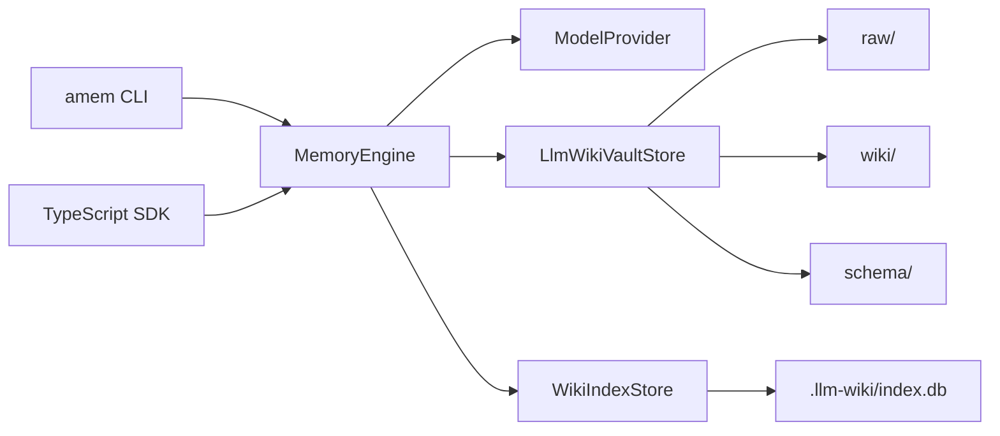

# 架构：LLM Wiki

Agent Memory 现在是一个本地优先的 LLM Wiki 编译器，而不是实体/关系图谱系统。

## 核心原则

- 文件系统是 source of truth。
- `raw/` 保存每次 ingest 的不可变原文。
- `wiki/` 保存 LLM 维护的人类可读 Markdown 页面。
- `schema/` 保存页面类型、写作风格和 lint 规则。
- `.llm-wiki/index.db` 只是可重建的 SQLite FTS 搜索索引。

## 数据流

## Ingest

1. `MemoryEngine.ingest` 把输入写入 `raw/YYYY/MM/DD/...md`。
2. 模型读取 raw、相关 wiki 页面和 schema，返回 `WikiUpdatePlan`。
3. Vault 创建或改写 `wiki/<slug>.md`。
4. 每个页面必须包含 `## Sources` 并引用 raw id。
5. `WikiIndexStore` 从文件重建搜索索引。

## Query

1. 通过 SQLite FTS 搜索 wiki 页面。
2. 读取页面引用的 raw source。
3. 模型只基于命中的页面和 source 合成答案。
4. JSON 输出为 `{ answer, pages, sources }`。

## Lint

`amem lint` 负责维护 wiki 健康度：

- 缺少 raw source。
- 缺少 `## Sources`。
- 断裂的 `[[wikilink]]`。
- 重复标题。
- 未被引用的 raw 文档。
- 模型可选检查潜在矛盾和重复主题。

`--fix` 只做确定性格式修复，不自动合并矛盾内容。

## 开发注意事项

- 项目是 ESM + TypeScript `NodeNext`。
- Node.js 需要 `>=22.13`，因为索引层使用 `node:sqlite`。
- `dist/` 是构建产物，不要手工编辑。
- 常用验证命令：`npm run typecheck`、`npm test`。
